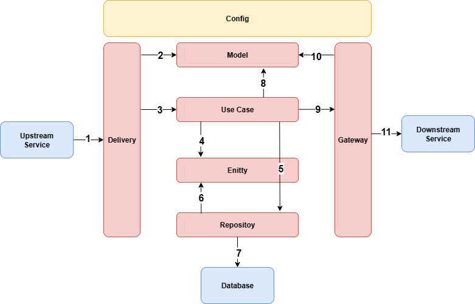
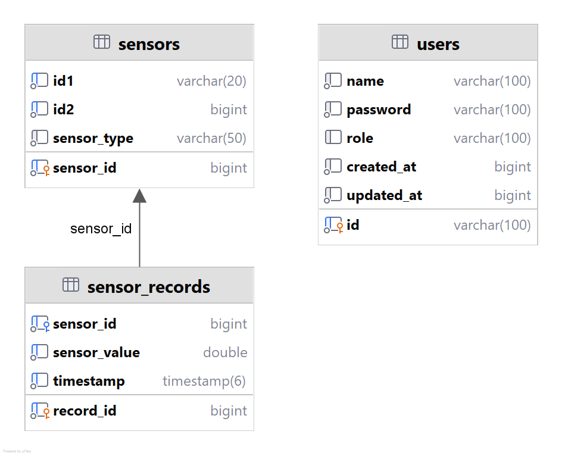

# IOT SERVER

## Description

Ingestion and API service for IoT sensor data. This service exposes REST endpoints for user and sensor operations, consumes MQTT messages from Mosquitto, and persists data to MySQL with Redis for caching/token features.

## Architecture



1. External system perform request (HTTP, Messaging (MQTT))
2. The Delivery creates various Model from request data
3. The Delivery calls Use Case, and execute it using Model data
4. The Use Case create Entity data for the business logic
5. The Use Case calls Repository, and execute it using Entity data
6. The Repository use Entity data to perform database operation
7. The Repository perform database operation to the database
8. The Use Case create various Model for Gateway or from Entity data
9. The Use Case calls Gateway, and execute it using Model data
10. The Gateway using Model data to construct request to external system
11. The Gateway perform request to external system (HTTP, Messaging (MQTT))

---  

## Data Flow


## Entity Relationship Diagram (ERD)




## Tech Stack

* Golang : [https://github.com/golang/go](https://github.com/golang/go)
* MySQL (Database) : [https://github.com/mysql/mysql-server](https://github.com/mysql/mysql-server)
* Mosquitto (MQTT Broker) : [https://github.com/eclipse-mosquitto/mosquitto](https://github.com/eclipse-mosquitto/mosquitto)
* Redis (Cache) : [https://github.com/redis/redis](https://github.com/redis/redis)

## Framework & Library

* Echo (HTTP Framework) – v4.13.4 : [https://github.com/labstack/echo](https://github.com/labstack/echo)
* Viper (Configuration) – v1.20.1 : [https://github.com/spf13/viper](https://github.com/spf13/viper)
* go-sql-driver/mysql (MySQL Driver) – v1.9.3 : [https://github.com/go-sql-driver/mysql](https://github.com/go-sql-driver/mysql)
* redis/go-redis (Redis Client) – v9.12.1 : [https://github.com/redis/go-redis](https://github.com/redis/go-redis)
* Eclipse Paho MQTT Go client (Messaging) – v1.5.0 : [https://github.com/eclipse-paho/paho.mqtt.golang](https://github.com/eclipse-paho/paho.mqtt.golang)
* Go Playground Validator (Validation) – v10.27.0 : [https://github.com/go-playground/validator](https://github.com/go-playground/validator)
* Logrus (Logger) – v1.9.3 : [https://github.com/sirupsen/logrus](https://github.com/sirupsen/logrus)
* golang-jwt/jwt (JWT) – v5.3.0 : [https://github.com/golang-jwt/jwt](https://github.com/golang-jwt/jwt)
* golang.org/x/crypto (Cryptography Utilities) – v0.41.0 : [https://pkg.go.dev/golang.org/x/crypto](https://pkg.go.dev/golang.org/x/crypto)

## Configuration

All example configuration is in `.env.example` file.

## API Spec

All API Spec is in `/api` folder.

## Postman Collection

Postman collection is in `/api/postman_collection` folder.

## Prerequisites

- Docker and Docker Compose
- Optional: Go 1.24 for local, non-Docker development

---  

## Quick Start (Docker)

1. Create .env file from .env.example
```  
cp .env.example .env  
```  

2. Run the app with docker (daemon mode):

```bash  
docker compose up -d
```  

- Follow logs:

```bash  
docker compose logs -f api
```  

3. Stop:

```bash  
docker compose down
```  

- Stop and clean up:

```bash  
docker compose down -v
```  
  
---  

## Simulate Sensor

To simulate incoming sensor data, use the companion repository **iot-sensor** and run it locally.

### 1) Open the repository
Go to: https://github.com/adimaspph/iot-sensor

### 2) Clone the repository
```bash  
git clone https://github.com/adimaspph/iot-sensor.git
cd iot-sensor
```  
  
### 2) Run iot-sensor  
run iot-sensor with docker  
```bash  
docker compose up -d
```  

## Configuration (`.env`)

Create a `.env` file at the project root. The following variables are commonly used by the service and `docker-compose.yml`.  
Example are in `.env.example.` Adjust names and defaults to match your setup
  
---  

## MQTT Ingestion

Publishers send JSON payloads to the configured topic (default: `iot/sensor/data`).

Example payload:

```json  
{  
 "id1": "SENSOR-1", "id2": 1, "sensor_type": "temperature", "sensor_value": 51.5, "timestamp": "2025-08-26T19:21:10Z"}  
```  

The service uses Paho MQTT to subscribe and forward validated messages to the `SensorUsecase` for persistence.
  
---  

## Local Development (without Docker)

```bash  
go mod download
cp .env.example .env   # if available
go run ./cmd/web
```
  
---  

## License

This repository is provided as-is. Add your license of choice (MIT, Apache-2.0, etc.).